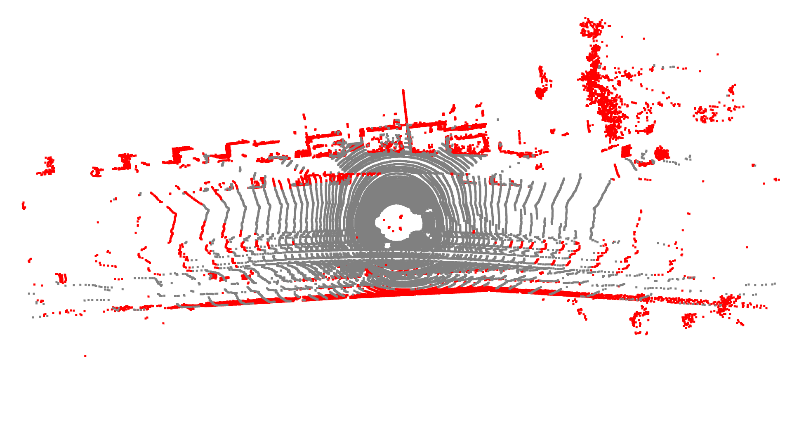
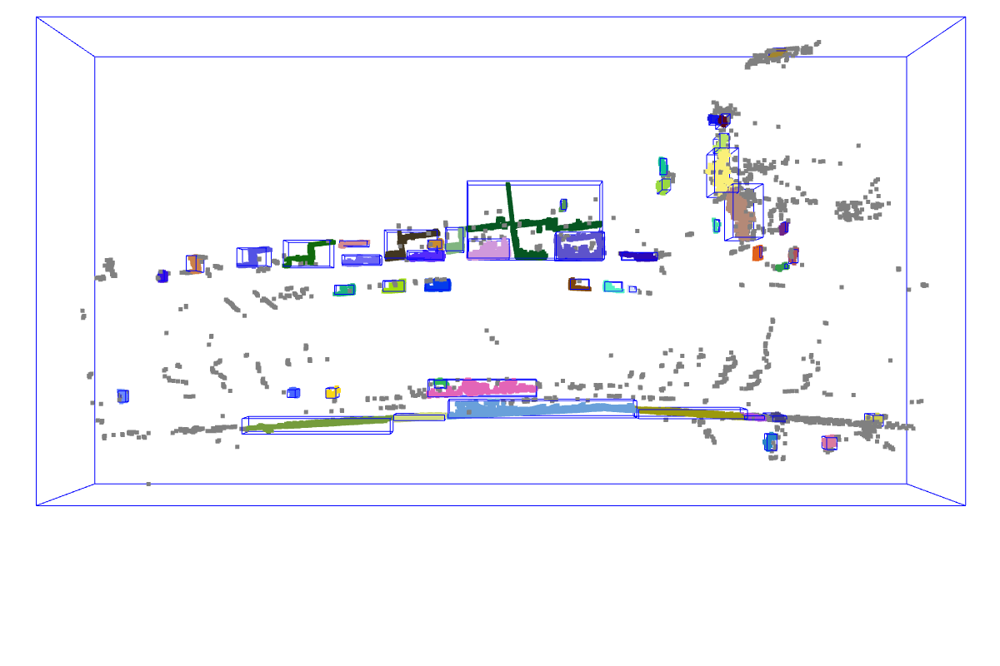

# KITTI Multi-Object Tracking

A real-time multi-object tracking system for autonomous vehicles using KITTI dataset. This project implements Kalman filter-based tracking with Hungarian algorithm data association to follow vehicles and obstacles through LiDAR point clouds.

## 🎯 What it does

- **Object Detection**: Clusters 3D LiDAR points to find vehicles and obstacles
- **Multi-Object Tracking**: Tracks multiple objects simultaneously using Kalman filters
- **Data Association**: Uses Hungarian algorithm for optimal track-to-detection matching
- **Smooth Visualization**: Creates tracking animations showing object movement over time
- **Real-time Performance**: Processes 101 frames in seconds with consistent tracking

## 🏗️ Project Structure

```
kitti-perception-playground/
├── object_tracker.py           # Main multi-object tracking system
├── kalman_filter.py           # Kalman filter implementation
├── multi_frame_pipeline.py    # Detection pipeline
├── cluster_objects.py         # Object clustering
├── segment_ground.py          # Ground removal
├── project_lidar_to_camera.py # Sensor fusion
├── load_data.py              # Data utilities
├── output/
│   ├── tracking.gif          # Tracking animation
│   └── tracking/             # Frame-by-frame images
└── data/                     # KITTI dataset
    └── 2011_09_26_drive_0001_sync/
```

## � Quick Start

### Installation
```bash
pip install numpy scipy matplotlib pillow open3d
```

### Get KITTI Data
1. Download from [KITTI Raw Data](http://www.cvlibs.net/datasets/kitti/raw_data.php)
2. Extract to `data/2011_09_26_drive_0001_sync/`

### Run Tracking
```bash
python object_tracker.py
```

That's it! The system will process 101 frames and create `output/tracking.gif` showing tracked objects moving through the scene.

## 🎬 What You'll See


The tracking animation shows:
- **Red circles**: New detections from LiDAR clustering
- **Colored circles**: Confirmed tracks (3+ consecutive hits)
- **Triangles**: Tentative tracks (new, unconfirmed)
- **Lines**: Track trajectories over time
- **Arrows**: Velocity vectors showing object movement

### Other Examples

**LiDAR-to-Camera Projection:**


**Ground Segmentation:**


**Object Clustering:**


## 🧠 How It Works

### Detection Pipeline
1. **Ground Removal**: RANSAC removes road surface points
2. **Clustering**: DBSCAN groups remaining points into objects
3. **Filtering**: Remove small/noisy clusters

### Tracking System
1. **Prediction**: Kalman filters predict where each track will be
2. **Association**: Hungarian algorithm matches new detections to predictions
3. **Update**: Matched tracks update their position/velocity estimates
4. **Management**: Create new tracks, delete lost ones

## 🎛️ Key Parameters

- **Frames**: 0-100 (101 total frames)
- **Max Association Distance**: 3.0 meters
- **Track Confirmation**: 3 consecutive hits
- **Track Deletion**: 5 missed frames
- **GIF Speed**: 0.2 seconds per frame (5 FPS)

## 🎯 Performance Stats

From the latest run:
- **101 frames processed** in real-time
- **1,285 total tracks created** 
- **72 active tracks** maintained simultaneously
- **Hungarian algorithm** ensures optimal data association
- **Fixed frame dimensions** create smooth tracking animations

## 💡 Technical Details

- **Kalman Filter**: Constant velocity model (position + velocity state)
- **Hungarian Algorithm**: Optimal assignment minimizing total distance cost
- **Track States**: Tentative → Confirmed → Deleted lifecycle
- **Visualization**: Fixed axis limits (-80 to 80m X, -30 to 50m Y) for smooth GIFs
- **Arrow Scaling**: 0.3x velocity vectors for clear movement indication

## 📚 Additional Scripts

While the main focus is multi-object tracking, the project includes other perception components:

- **`project_lidar_to_camera.py`** - Sensor fusion projecting 3D LiDAR onto 2D images
- **`segment_ground.py`** - RANSAC-based ground plane removal
- **`cluster_objects.py`** - DBSCAN clustering with filtering
- **`load_data.py`** - Basic data loading and 3D visualization

Perfect for learning computer vision, autonomous vehicle perception, or multi-object tracking algorithms!

