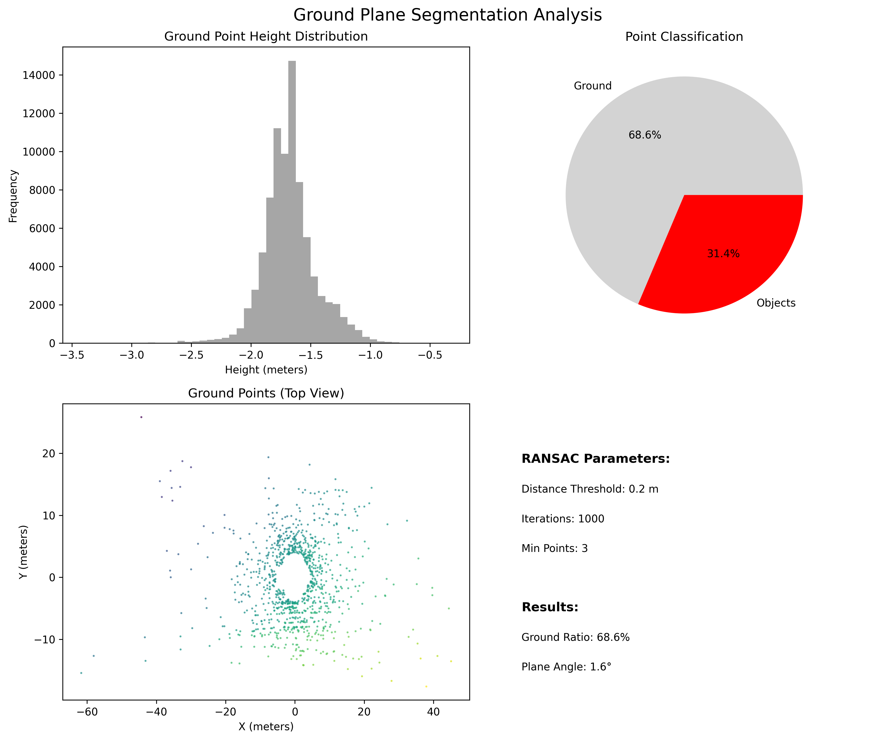
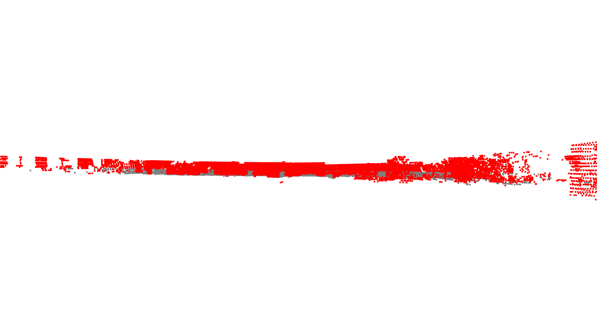
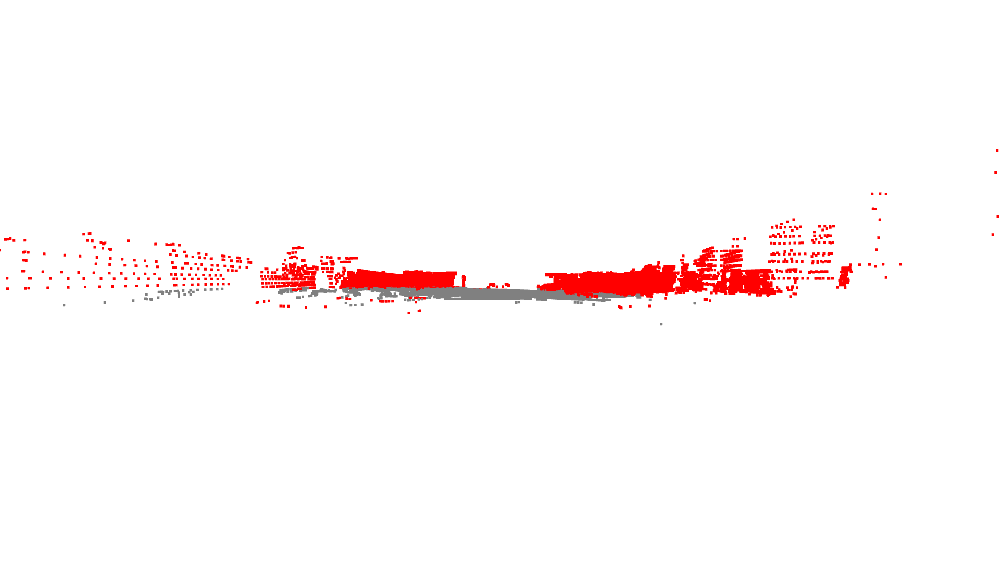
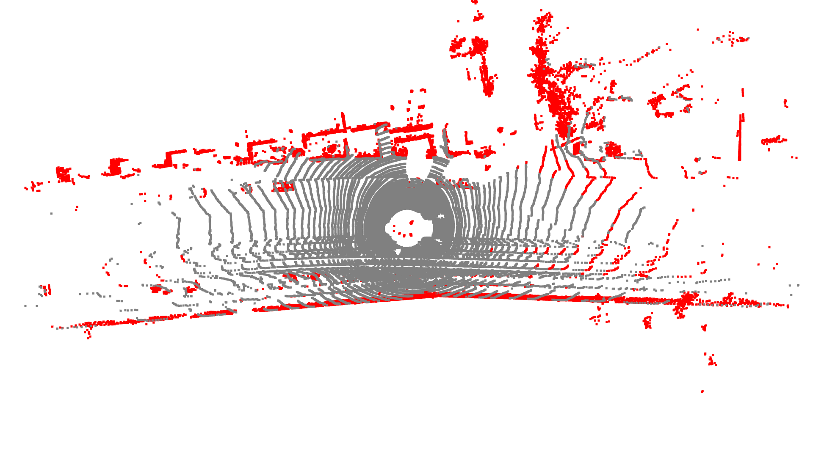

# KITTI Perception Playground

A comprehensive implementation of core autonomous vehicle perception tasks using the KITTI dataset. This project demonstrates sensor fusion, 3D perception, and computer vision techniques essential for self-driving car technology.

## 🚗 Project Overview

This repository explores fundamental perception tasks in autonomous driving by implementing:
- **LiDAR-to-Camera Projection**: Sensor fusion between 3D LiDAR and 2D camera data
- **Ground Plane Segmentation**: RANSAC-based ground removal for object detection
- **3D Point Cloud Visualization**: Interactive visualization of LiDAR data
- **Multi-modal Data Synchronization**: Timestamp alignment between sensors

## 🎯 Key Features

- **Real-time 3D Visualization**: Interactive point cloud rendering with Open3D
- **Sensor Fusion**: Project 3D LiDAR points onto 2D camera images
- **Depth-based Color Coding**: Visualize distance information intuitively
- **Ground Segmentation**: Identify and remove ground plane for object focus

## 📁 Project Structure

```
kitti-perception-playground/
├── README.md
├── requirements.txt
├── .gitignore
├── load_data.py              # Data loading and basic visualization
├── project_lidar_to_camera.py # LiDAR-to-Camera projection
├── segment_ground.py         # Ground plane segmentation
├── output/                   # Generated visualizations
│   ├── lidar_projection_*.png
│   ├── ground_segmentation_*.png
│   └── point_cloud_*.png
└── data/                     # KITTI dataset (not tracked in git)
    └── 2011_09_26_drive_0001_sync/
```

## 🛠️ Installation

### Prerequisites
- Python 3.8+
- pip package manager

### Dependencies
```bash
pip install -r requirements.txt
```

**Required packages:**
- `numpy` - Numerical computing
- `opencv-python` - Computer vision operations
- `open3d` - 3D visualization and processing
- `matplotlib` - Plotting and color mapping

## 📊 Dataset Setup

1. **Download KITTI Dataset**:
   - Visit [KITTI Raw Data](http://www.cvlibs.net/datasets/kitti/raw_data.php)
   - Download a sample drive (e.g., `2011_09_26_drive_0001`)
   - Extract to `data/` directory

2. **Expected Structure**:
   ```
   data/2011_09_26_drive_0001_sync/
   ├── calib_cam_to_cam.txt
   ├── calib_velo_to_cam.txt
   ├── image_02/
   │   ├── data/
   │   └── timestamps.txt
   └── velodyne_points/
       ├── data/
       └── timestamps.txt
   ```

## 🚀 Scripts and Usage

### 1. load_data.py - Data Loading and 3D Visualization

#### Description
The foundational script that demonstrates how to load and visualize KITTI dataset components. This script parses calibration files, loads LiDAR point clouds from binary files, and creates interactive 3D visualizations using Open3D.

#### What it does:
- Parses KITTI calibration files (calib_cam_to_cam.txt, calib_velo_to_cam.txt)
- Loads LiDAR point cloud data from .bin files
- Creates interactive 3D point cloud visualization
- Displays point cloud with coordinate axes and proper scaling

#### Dependencies:
- `numpy` - For numerical array operations
- `open3d` - For 3D visualization and point cloud processing
- `os` - For file path operations
- `glob` - For file pattern matching

#### How to run:
```bash
python load_data.py
```

#### Expected Output:
- Interactive 3D viewer window opens with the point cloud
- Console output showing number of points loaded
- Ability to rotate, zoom, and pan the 3D view


*Interactive 3D visualization of KITTI LiDAR point cloud showing the street scene from the vehicle's perspective*

---

### 2. project_lidar_to_camera.py - LiDAR-to-Camera Projection

#### Description
The core sensor fusion script that demonstrates how to project 3D LiDAR points onto 2D camera images. This is a fundamental task in autonomous vehicle perception, enabling the combination of depth information from LiDAR with visual information from cameras.

#### What it does:
- Loads synchronized camera images and LiDAR point clouds
- Applies coordinate system transformations (Velodyne → Camera → Image)
- Projects 3D points to 2D image coordinates using calibration matrices
- Filters points that fall within image boundaries
- Color-codes projected points by depth (red = close, blue = far)
- Saves the final projection result as an image

#### Dependencies:
- `numpy` - For matrix operations and numerical computing
- `opencv-python` - For image processing and display
- `matplotlib` - For color mapping and visualization
- `glob` - For file management
- `typing` - For type hints

#### How to run:
```bash
python project_lidar_to_camera.py
```

#### Configuration:
Update the `data_path` variable in the `main()` function to point to your KITTI dataset location.

#### Expected Output:
- Console output with projection statistics
- Saved image in `output/` directory
- Optional display window showing the projection result

<<<<<<< HEAD
**Sample Output:**
=======
>>>>>>> 6649f89 (feat: Implement RANSAC for ground plane segmentation.)


*LiDAR points projected onto camera image with depth-based color coding. Red points are closer objects, blue points are farther away*

#### Sample Statistics:
```
Projection Statistics:
  Total LiDAR points: 124,668
  Points in image: 8,247
  Depth range: 2.15 - 49.83 meters
  Average depth: 12.34 meters
```

---

### 3. segment_ground.py - Ground Plane Segmentation

#### Description
An advanced perception script that implements RANSAC-based ground plane detection and segmentation. This technique is crucial for autonomous vehicles to distinguish between the road surface and obstacles/objects that need to be avoided.

#### What it does:
- Loads LiDAR point cloud data
- Applies RANSAC algorithm to detect the dominant ground plane
- Segments points into ground vs. non-ground categories
- Creates visualization with different colors for ground (gray) and objects (red)
- Saves segmentation results and statistics

#### Dependencies:
- `numpy` - For numerical operations
- `open3d` - For 3D processing and RANSAC implementation
- `matplotlib` - For visualization and color mapping
- `os` - For file operations

#### How to run:
```bash
python segment_ground.py
```

#### Algorithm Parameters:
- **Distance threshold**: 0.2 meters (points within this distance are considered part of the plane)
- **RANSAC iterations**: 1000 (maximum number of iterations for plane fitting)
- **Minimum plane points**: 1000 (minimum number of points required for a valid plane)

#### Expected Output:
- Console output with segmentation statistics
- Interactive 3D visualization showing ground vs. objects
- Saved segmentation result images from multiple views






*Multiple views of ground plane segmentation: analysis, front, side, and top perspectives help visualize how the algorithm distinguishes ground points (gray) from obstacles (red).*


## 📚 References

- [KITTI Dataset Paper](http://www.cvlibs.net/publications/Geiger2013IJRR.pdf)
- [Computer Vision: Algorithms and Applications](http://szeliski.org/Book/)
- [Multiple View Geometry](https://www.robots.ox.ac.uk/~vgg/hzbook/)
<<<<<<< HEAD

## 🤝 Contributing

Contributions are welcome! Please:
1. Fork the repository
2. Create a feature branch
3. Commit your changes
4. Push to the branch
5. Create a Pull Request

## 📄 License

This project is licensed under the MIT License - see the LICENSE file for details.

## 🙏 Acknowledgments

- **KITTI Dataset**: Karlsruhe Institute of Technology
- **Open3D**: Open-source 3D data processing library
- **OpenCV**: Computer vision library
- **NumPy**: Numerical computing foundation

---

**Made with ❤️ for autonomous vehicle perception research**

*Star ⭐ this repository if you find it useful!*
=======
>>>>>>> 6649f89 (feat: Implement RANSAC for ground plane segmentation.)
