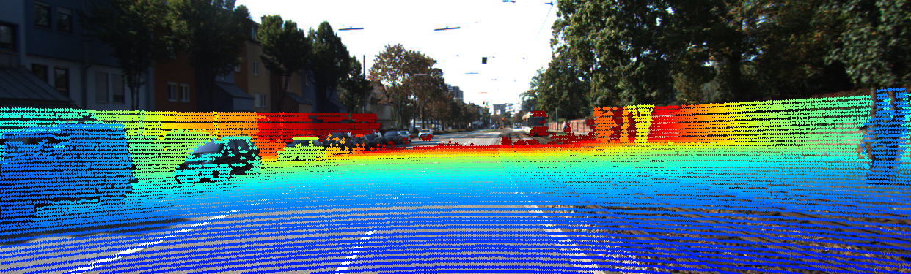
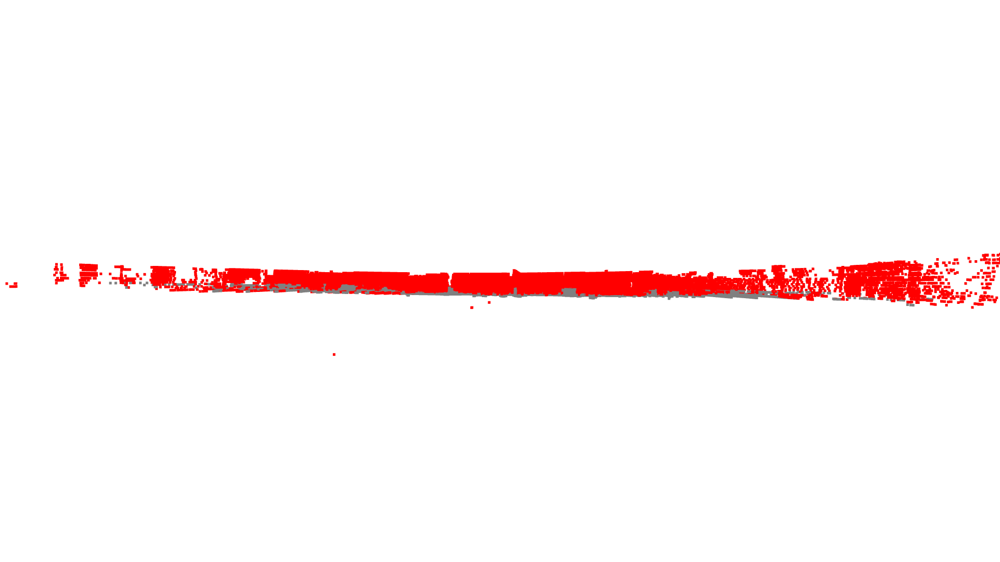

# KITTI Perception Playground

A comprehensive implementation of core autonomous vehicle perception tasks using the KITTI dataset. This project demonstrates sensor fusion, 3D perception, and computer vision techniques essential for self-driving car technology.

## 🚗 Project Overview

This repository explores fundamental perception tasks in autonomous driving by implementing:
- **LiDAR-to-Camera Projection**: Sensor fusion between 3D LiDAR and 2D camera data
- **Ground Plane Segmentation**: RANSAC-based ground removal for object detection
- **3D Point Cloud Visualization**: Interactive visualization of LiDAR data
- **Object Clustering & Filtering**: DBSCAN clustering with bounding‑box based filtering

## 🎯 Key Features

- **Real-time 3D Visualization**: Interactive point cloud rendering with Open3D
- **Sensor Fusion**: Project 3D LiDAR points onto 2D camera images
- **Depth-based Color Coding**: Visualize distance information intuitively
- **Ground Segmentation**: Identify and remove ground plane for object focus
- **Object Clustering**: Cluster non‑ground points via DBSCAN
- **Bounding‑Box Filtering**: Keep only clusters meeting volume and point‑count thresholds
- **Top‑View & Interactive Visuals**: Save overhead snapshots and launch 3D viewer

## 📁 Project Structure

```
kitti‑perception‑playground/
├── README.md
├── requirements.txt
├── .gitignore
├── load_data.py                # Data loading and basic visualization
├── project_lidar_to_camera.py  # LiDAR‑to‑Camera projection
├── segment_ground.py           # Ground plane segmentation
├── cluster_objects.py          # Object clustering & filtering pipeline
├── output/                     # Generated visualizations
│   ├── point_cloud_*.png
│   ├── lidar_projection_*.png
│   ├── ground_segmentation_*.png
│   └── perception_pipeline_frame_*.png
└── data/                       # KITTI dataset (not tracked in git)
    └── 2011_09_26_drive_0001_sync/
        ├── calib_cam_to_cam.txt
        ├── calib_velo_to_cam.txt
        ├── image_02/data/
        ├── image_02/timestamps.txt
        ├── velodyne_points/data/
        └── velodyne_points/timestamps.txt
```

## 🛠️ Installation

### Prerequisites
- Python 3.8+
- pip package manager

### Dependencies
```bash
pip install -r requirements.txt
```

**Required packages:**
- `numpy` - Numerical computing
- `opencv-python` - Computer vision operations
- `open3d` - 3D visualization and processing
- `matplotlib` - Plotting and color mapping

## 📊 Dataset Setup

1. **Download KITTI Dataset**:
   - Visit [KITTI Raw Data](http://www.cvlibs.net/datasets/kitti/raw_data.php)
   - Download a sample drive (e.g., `2011_09_26_drive_0001`)
   - Extract to `data/` directory

2. **Expected Structure**:
   ```
   data/2011_09_26_drive_0001_sync/
   ├── calib_cam_to_cam.txt
   ├── calib_velo_to_cam.txt
   ├── image_02/
   │   ├── data/
   │   └── timestamps.txt
   └── velodyne_points/
       ├── data/
       └── timestamps.txt
   ```

## 🚀 Scripts and Usage

### 1. load_data.py - Data Loading and 3D Visualization

#### Description
The foundational script that demonstrates how to load and visualize KITTI dataset components. This script parses calibration files, loads LiDAR point clouds from binary files, and creates interactive 3D visualizations using Open3D.

#### What it does:
- Parses KITTI calibration files (calib_cam_to_cam.txt, calib_velo_to_cam.txt)
- Loads LiDAR point cloud data from .bin files
- Creates interactive 3D point cloud visualization
- Displays point cloud with coordinate axes and proper scaling

#### Dependencies:
- `numpy` - For numerical array operations
- `open3d` - For 3D visualization and point cloud processing
- `os` - For file path operations
- `glob` - For file pattern matching

#### How to run:
```bash
python load_data.py
```

#### Expected Output:
- Interactive 3D viewer window opens with the point cloud
- Console output showing number of points loaded
- Ability to rotate, zoom, and pan the 3D view


*Interactive 3D visualization of KITTI LiDAR point cloud showing the street scene from the vehicle's perspective*

---

### 2. project_lidar_to_camera.py - LiDAR-to-Camera Projection

#### Description
The core sensor fusion script that demonstrates how to project 3D LiDAR points onto 2D camera images. This is a fundamental task in autonomous vehicle perception, enabling the combination of depth information from LiDAR with visual information from cameras.

#### What it does:
- Loads synchronized camera images and LiDAR point clouds
- Applies coordinate system transformations (Velodyne → Camera → Image)
- Projects 3D points to 2D image coordinates using calibration matrices
- Filters points that fall within image boundaries
- Color-codes projected points by depth (red = close, blue = far)
- Saves the final projection result as an image

#### Dependencies:
- `numpy` - For matrix operations and numerical computing
- `opencv-python` - For image processing and display
- `matplotlib` - For color mapping and visualization
- `glob` - For file management
- `typing` - For type hints

#### How to run:
```bash
python project_lidar_to_camera.py
```

#### Configuration:
Update the `data_path` variable in the `main()` function to point to your KITTI dataset location.

#### Expected Output:
- Console output with projection statistics
- Saved image in `output/` directory
- Optional display window showing the projection result

**Sample Output:**


*LiDAR points projected onto camera image with depth-based color coding. Red points are closer objects, blue points are farther away*

#### Sample Statistics:
```
Projection Statistics:
  Total LiDAR points: 124,668
  Points in image: 8,247
  Depth range: 2.15 - 49.83 meters
  Average depth: 12.34 meters
```

---

### 3. segment_ground.py - Ground Plane Segmentation

#### Description
An advanced perception script that implements RANSAC-based ground plane detection and segmentation. This technique is crucial for autonomous vehicles to distinguish between the road surface and obstacles/objects that need to be avoided.

#### What it does:
- Loads LiDAR point cloud data
- Applies RANSAC algorithm to detect the dominant ground plane
- Segments points into ground vs. non-ground categories
- Creates visualization with different colors for ground (gray) and objects (red)
- Saves segmentation results and statistics

#### Dependencies:
- `numpy` - For numerical operations
- `open3d` - For 3D processing and RANSAC implementation
- `matplotlib` - For visualization and color mapping
- `os` - For file operations

#### How to run:
```bash
python segment_ground.py
```

#### Algorithm Parameters:
- **Distance threshold**: 0.2 meters (points within this distance are considered part of the plane)
- **RANSAC iterations**: 1000 (maximum number of iterations for plane fitting)
- **Minimum plane points**: 1000 (minimum number of points required for a valid plane)

#### Expected Output:
- Console output with segmentation statistics
- Interactive 3D visualization showing ground vs. objects
- Saved segmentation result images from multiple views





*Multiple views of ground plane segmentation: analysis, front, side, and top perspectives help visualize how the algorithm distinguishes ground points (gray) from obstacles (red).*

### 4. cluster\_objects.py – Object Clustering & Filtering

**Description:**
A complete clustering pipeline wrapped in a `PerceptionPipeline` class:

1. Load & remove ground points using RANSAC
2. Cluster non‑ground points via DBSCAN
3. Filter clusters by bounding‑box volume and point count
4. Save a top‑view PNG snapshot
5. Launch an interactive Open3D 3D viewer

**Dependencies:**

* `numpy`
* `open3d`
* `os`

**How to run:**

```bash
python cluster_objects.py
```

**Configuration:**
Override defaults by passing a `config` dict into `PerceptionPipeline`:

```python
custom_config = {
  'filter': {'min_volume': 2.0, 'min_points': 30},
  'dbscan': {'eps': 0.5, 'min_points': 15}
}
pipeline = PerceptionPipeline(data_path, custom_config)
```

**Expected Output:**

* Console logs of each processing step
* Top‑view image saved to `output/perception_pipeline_frame_000010.png`
* Interactive 3D window with colored clusters and bounding boxes


## 🔍 3D Object Tracking

A **multi-object tracking module** is integrated into the perception pipeline. It uses Kalman filtering and nearest neighbor association to follow 3D objects over time in the top-down LiDAR view.

### ✨ Key Features

* **Kalman Filter Per Track**: Each object is tracked using an independent Kalman filter estimating 3D position and velocity.
* **Nearest Neighbor Association**: Objects are matched across frames using minimum Euclidean distance.
* **Track Lifecycle Management**:

  * New detections spawn *tentative* tracks (triangle markers).
  * Tracks confirmed after 3 hits become *confirmed* (circle markers).
  * Tracks are deleted if not matched for 5 frames.
* **Consistent Visualization**:

  * Fixed axis limits for spatial consistency across frames (X: −90 to 90, Y: −40 to 60).
  * Bounding boxes show object dimensions.
  * Velocity arrows and track IDs are annotated.
  * Legend describes marker styles.
* **Animated Output**:

  * Each frame is saved with bounding boxes, IDs, and motion vectors.
  * Frames are compiled into a `.gif` for easy visual inspection.

### 🎥 Tracking Demo


> *An overhead view of tracked clusters across frames. Confirmed tracks are circles, tentative tracks are triangles, and gray dots represent clustered LiDAR points.*

### 🧠 Algorithmic Flow

1. **Detection Input**: Each frame provides object detections from the clustering pipeline.
2. **Predict**: Each track predicts its next state using its Kalman model.
3. **Associate**: New detections are matched to predicted track positions using nearest neighbor matching with a distance threshold.
4. **Update**: Matches update the track's state; unmatched detections create new tentative tracks.
5. **Prune**: Tracks without matches for >5 frames are removed.

### 🧪 Run It

```bash
python multi_object_tracking_demo.py
```

* Ensure the KITTI dataset is downloaded to `data/`.
* GIF is saved to `output/tracking/tracking.gif`.

---

## 📚 References

- [KITTI Dataset Paper](http://www.cvlibs.net/publications/Geiger2013IJRR.pdf)
- [Computer Vision: Algorithms and Applications](http://szeliski.org/Book/)
- [Multiple View Geometry](https://www.robots.ox.ac.uk/~vgg/hzbook/)

